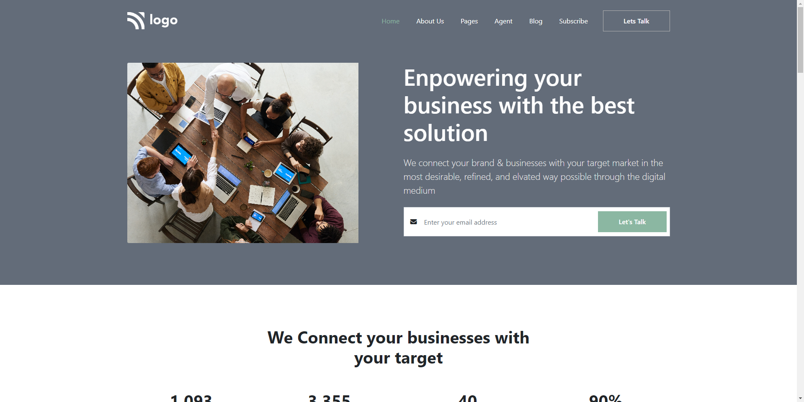

# HTML  , CSS  and Bootstrap 

# Project 12 - Business Solution Web 

By Maulik Vadodariya

## [Link to the live Project](https://business-solution-web.netlify.app/)

## What I learned from this Project?

- I have done this project using `HTML` ,  `CSS` and `Bootstrap`.
- In this project I learned how to make responsive web design using Bootstrap.
- `Bootstrap` responsive design and full end to end project.

## I spent 13 to 14 hours in making this project

